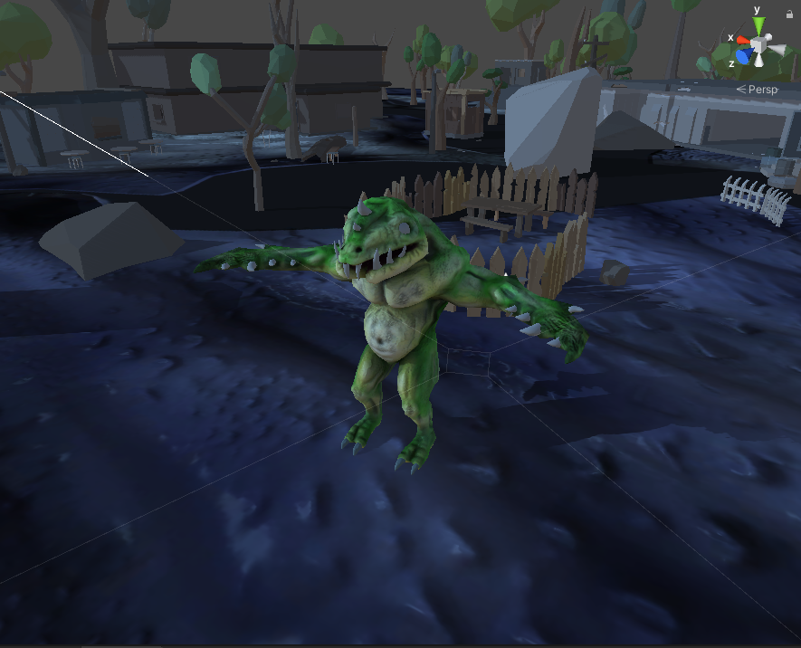

  <h1>AI Pathfinding Unity</h1>

 
  

**Table of content**
- [Game Summary](#game-summary)
- [Description](#description)
- [Player Objectives](#player-objectives)

# Game Summary

AI Pathfinding example based on https://learn.unity.com/tutorial/unity-navmesh?projectId=5f60d859edbc2a001ee947ea

**Common Information**

**Target Audience:** All ages  
**Genre:** NA  
**Engine:** Unity  

# Description
Monster walking.

# Player Objectives
- Click where you want to go

